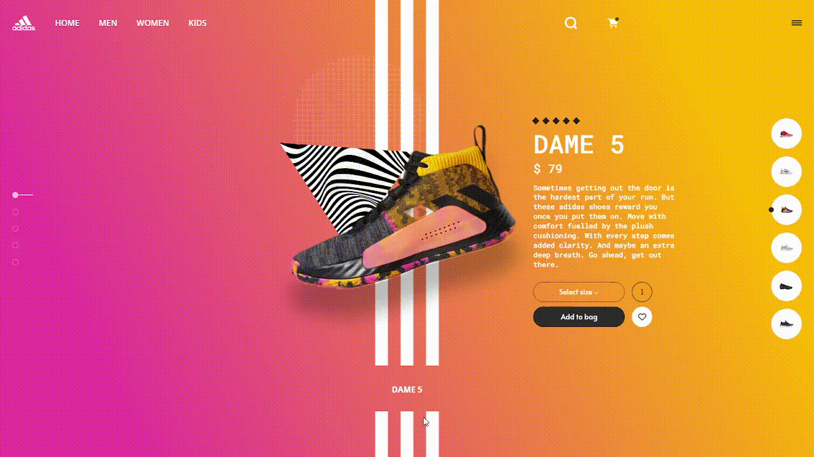

<h1 align="center"> NIKE SHOES - dame 5 | by Sanjay </h1>

# Projeto

Esse projeto tem como foco melhorar as habilidades de html, css e js. 
Aplicando os conceitos aprendidos em uma interface da comunidade do figma.
Projeto apenas para aprendizado.

# Link

> <https://gustav0dedeus.github.io/shoes/>

# Linguagens

* <h2>HTML</h2>
* <h2>CSS</h2>
* <h2>JS</H2>
